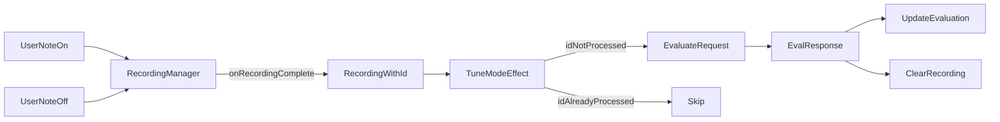

## Tune Eval Flow (Debug)

This diagram documents the Tune practice evaluation pipeline with recording ID
dedupe and post-eval clearing to prevent re-sends.

```mermaid
flowchart LR
  UserNoteOn --> RecordingManager
  UserNoteOff --> RecordingManager
  RecordingManager -->|"onRecordingComplete"| RecordingWithId
  RecordingWithId --> TuneModeEffect
  TuneModeEffect -->|"idNotProcessed"| EvaluateRequest
  TuneModeEffect -->|"idAlreadyProcessed"| Skip
  EvaluateRequest --> EvalResponse
  EvalResponse --> UpdateEvaluation
  EvalResponse --> ClearRecording
```
